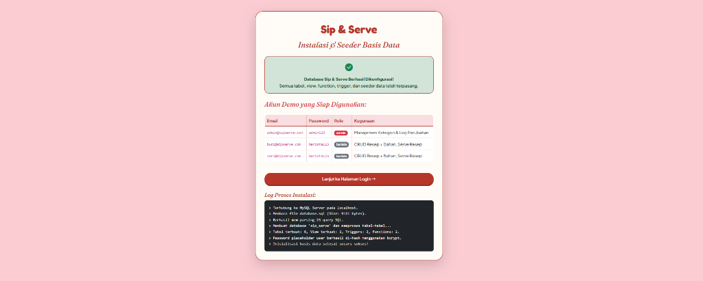
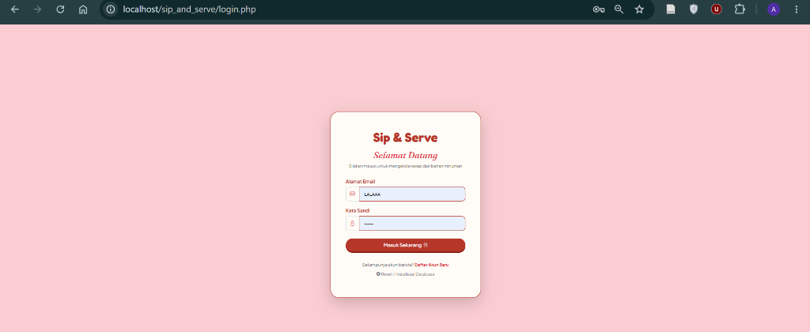
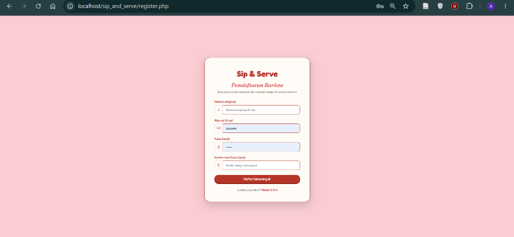
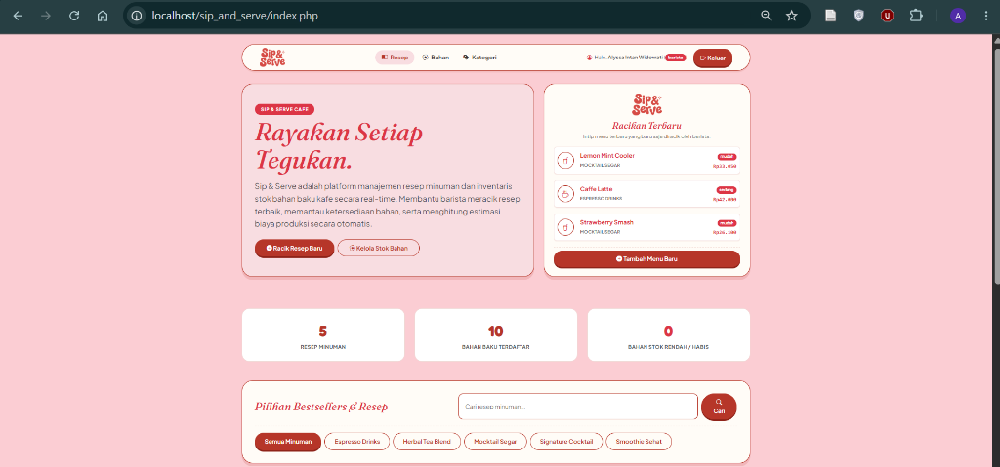
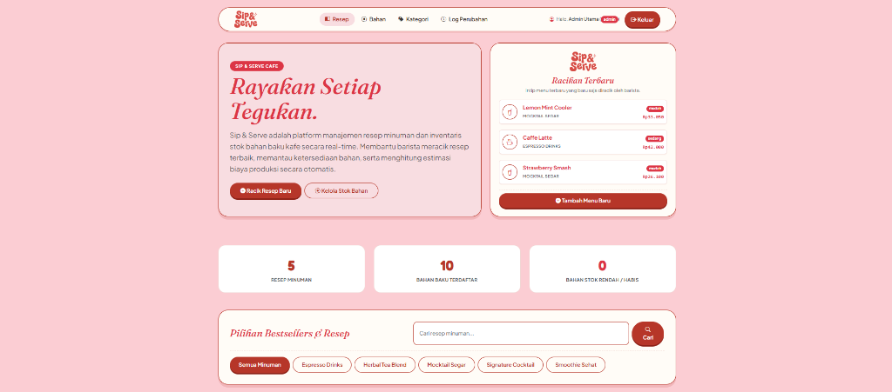
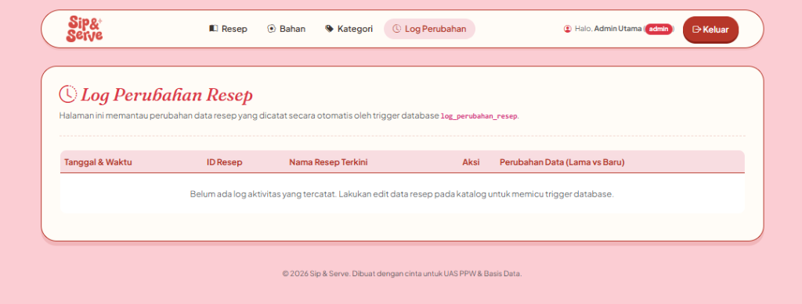

# Sip & Serve: Aplikasi Manajemen Resep dan Inventaris Cafe

Sip & Serve adalah aplikasi berbasis web dengan PHP Native dan MySQL. Aplikasi ini dibuat untuk membantu mengelola resep minuman dan stok bahan baku di cafe secara real-time.

Aplikasi ini memiliki dua peran pengguna, yaitu Barista dan Admin. Barista bisa melihat resep, mengelola bahan, dan mencatat penyajian minuman. Admin memiliki semua akses Barista ditambah kemampuan mengelola kategori dan melihat log perubahan.

## Cara Install

Berikut adalah langkah-langkah untuk menjalankan aplikasi ini di komputer Anda:

1. **Prasyarat Sistem**
   - Pastikan Anda sudah menginstal XAMPP (yang memiliki PHP dan MySQL).

2. **Salin Folder Project**
   - Salin folder `sip_and_serve` ke dalam direktori root web server Anda:
     - Di Windows (XAMPP): `C:\xampp\htdocs\sip_and_serve\`

3. **Nyalakan Apache dan MySQL**
   - Buka XAMPP Control Panel, lalu jalankan (Start) service **Apache** dan **MySQL**.
   - Catatan: Aplikasi ini menggunakan port database default **3307**. Jika MySQL Anda menggunakan port default **3306**, silakan ubah nilai `$db_port = '3307';` menjadi `'3306'` di file `config.php` dan `setup.php`.

4. **Inisialisasi Database**
   - Buka browser Anda dan akses alamat berikut:
     `http://localhost/sip_and_serve/`
   - Anda akan dialihkan ke halaman `setup.php` secara otomatis.
   - Klik tombol **Mulai Inisialisasi Database**.
   - Sistem akan membuat database `sip_serve` beserta seluruh tabel dan data contoh secara otomatis.

5. **Login ke Aplikasi**
   - Setelah setup selesai, Anda bisa login menggunakan akun demo berikut:
     - **Admin**: Email `admin@sipserve.com`, Password `admin123`
     - **Barista**: Email `budi@sipserve.com`, Password `barista123`
     - **Barista**: Email `sari@sipserve.com`, Password `barista123`

## Screenshot

Berikut adalah beberapa tampilan halaman dari aplikasi Sip & Serve:

### 1. Halaman Setup Database

### 2. Halaman Login

### 3. Halaman Register

### 4. Dashboard Utama (Barista)

### 5. Dashboard Utama (Admin)

### 6. Halaman Log Perubahan (Khusus Admin)

